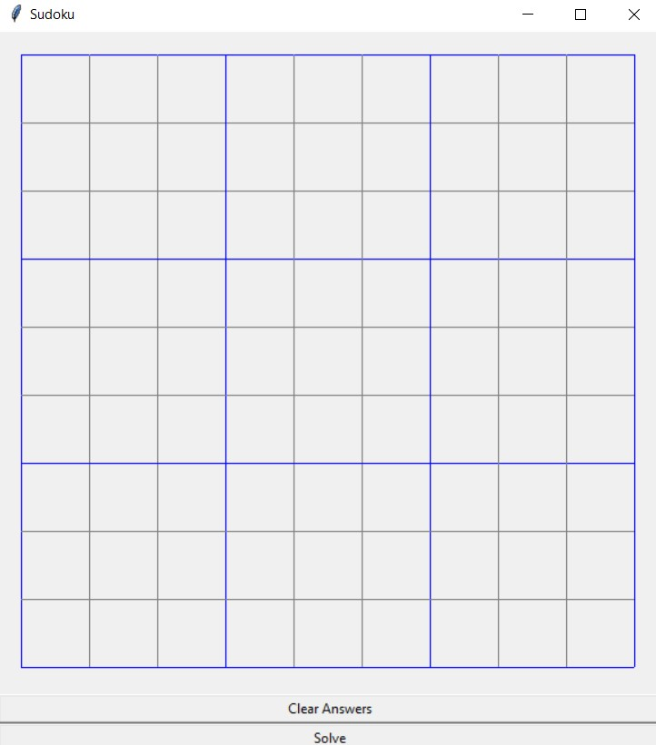

# sudoku-solver

## Description

Tkinter is used to create an interactive sudoku board which allows the user to play sudoku on it.
There are two buttons, one to clear the board and another that solves the board for the user. The
solving of the sudoku board was implemented through a backtracking algorithm I made for a leetcode
problem.

## How to use it

Click on a cell once to select it and click on it again to deselect it. Once a cell is selected, you can put
the numbers 1-9 in the cell by simply typing the number. If you wish to clear a cell, select it and press the
number 0.

## Why

This project was created because I personally enjoy playing sudoku, but I would occasionaly get stuck. This way, if
I'm ever stuck I can run the sudoku-solver program and simply input my current board into the program and have it solve
it for me. Hopefully this program can also help others who get stuck when playing Sudoku.

## Improvements

Giving better user-feedback into which cell is highlighted is a definite improvement that will be implemented.
Also, just making it look better in general is quite important.
